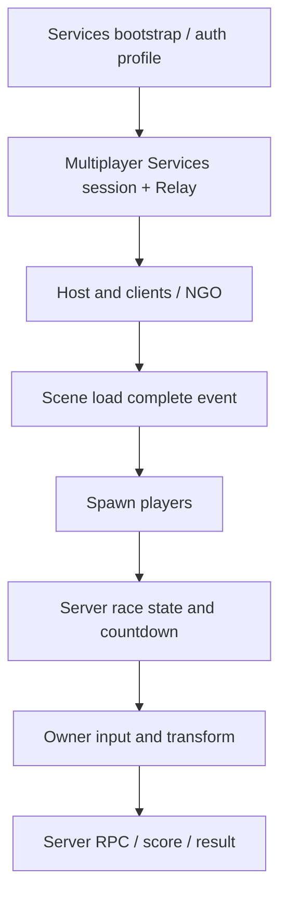

# Seoul Multiplayer

Relay 세션으로 참가자를 연결하고, 씬 로딩과 경기 상태를 동기화하는 Unity 멀티플레이 러닝 프로토타입.

> 문서 검토본. 기본 최대 4인 설정은 코드상 구성값이며 실제 동시 플레이 시험 결과와 구별합니다.

## Why

참가자마다 로딩·접속 완료 시점이 달라도 플레이어 생성, 경기 시작, 결과 전파를 일관된 흐름으로 연결해야 합니다. 팀원이 stage를 추가할 때 사용할 공통 네트워크 구조를 제공합니다.

## What it does

- Multiplayer Services session 생성/참여와 Relay 네트워크 연결
- NGO 씬 로딩 완료 이벤트를 기준으로 player 생성
- 서버 경기 상태·카운트다운·점수와 결과 전파
- 다중 stage의 플레이어·아이템 동기화 관련 코드

## My Contribution

4인 팀에서 달리기 메커니즘과 멀티플레이 공통부를 구현했습니다.

- [자동 전진](https://github.com/hardlyPw/Seoul_AI_GongmoJun/commit/ea85b15), [달리기 상태 머신·대시](https://github.com/hardlyPw/Seoul_AI_GongmoJun/commit/56955a3), [동일 lane 충돌 처리](https://github.com/hardlyPw/Seoul_AI_GongmoJun/commit/814b81e)
- [멀티플레이 기반](https://github.com/hardlyPw/Seoul_AI_GongmoJun/commit/b88ecb6), [경기 상태](https://github.com/hardlyPw/Seoul_AI_GongmoJun/commit/d9ef4e1), [다중 stage](https://github.com/hardlyPw/Seoul_AI_GongmoJun/commit/99012eb)
- [1스테이지 날씨 기믹](https://github.com/hardlyPw/Seoul_AI_GongmoJun/commit/5c19130): 과거 구현 이력. 현재 기본 브랜치에는 해당 Weather 파일이 없어 현재 실행 기능으로 제시하지 않습니다.

점프 버퍼·장애물·플레이어 수정·다른 stage에는 팀원 기여가 있습니다. 1스테이지 전체 씬·에셋의 단독 제작으로 표현하지 않습니다.

## Architecture

## Key Technical Decisions

- **Host-client + Relay:** 설계 문서는 시연 목적과 운영 부담을 이유로 제시합니다. 호스트 의존성이 남으며 운영비 0원 실측을 주장하지 않습니다.
- **혼합 권위:** owner의 이동과 server의 경기 상태를 구분합니다. 완전한 서버 권위·안티치트 구조는 아닙니다.
- **로딩 후 생성:** `NetworkRaceManager`의 `OnLoadEventCompleted`에서 완료된 client에 대해 spawn합니다.
- **인스턴스별 profile:** bootstrap에 인증 profile 분리가 존재해 로컬 복수 인스턴스 구성을 지원합니다.

## Results

세션·경기 상태·씬/결과 전환 코드와 팀 통합 문서가 있습니다. 공모전 제출/수상, 실제 4인 시연, latency·운영비는 [NEEDS VERIFICATION]입니다. 이번 문서 감사에서는 Unity 실행을 검증하지 않았습니다.

## Getting Started

1. `ProjectSettings/ProjectVersion.txt`에 기록된 Unity **6000.3.10f1**로 `Project-Seoul`을 엽니다.
2. `Packages/manifest.json`의 패키지를 복원합니다. 저장된 NGO는 **2.11.2**, Multiplayer Services는 **2.2.2**입니다.
3. 본인 또는 팀이 승인한 UGS 프로젝트 연결과 서비스 설정을 완료합니다.
4. Bootstrap/Title에서 host 생성·code 참여 흐름을 시작합니다. 실제 씬·prefab 등록은 프로젝트 설정 및 기존 문서를 확인합니다.

전체 체크아웃에는 에셋이 필요합니다. 문서 감사용 sparse checkout은 게임 실행 배포본이 아닙니다.

## Project Structure

- `Project-Seoul/Assets/Scripts/Network/`: bootstrap, session, state, result
- `Project-Seoul/Assets/Scripts/Racing/`: 입력·플레이어·stage·아이템
- `Project-Seoul/Packages/manifest.json`: dependency 설정
- [MULTIPLAYER_ARCHITECTURE.md](MULTIPLAYER_ARCHITECTURE.md): 기존 설계와 팀 통합 가이드

## Testing / Evaluation

기존 문서의 Multiplayer Play Mode 절차로 host와 client를 시험할 수 있습니다. 실행 기록은 미확인입니다. 검증 항목은 join, scene load, spawn, late join, timeout, host 종료, score/result 전파입니다.

## Limitations

- 기존 설계 문서의 예정 클래스·bot 충원과 현재 구현을 구분해야 합니다.
- 초기 문서의 개별 Lobby/Relay 설명 대신 현재 코드는 `ISession`/`WithRelayNetwork()`를 사용합니다.
- owner movement의 신뢰 범위가 남습니다. 보안 완비 사례로 제시하지 않습니다.
- 실제 테스트 결과와 배포·공모전 결과가 확인되지 않았습니다.

## Links

- [기존 아키텍처·팀 가이드](MULTIPLAYER_ARCHITECTURE.md)
- Portfolio / Demo: [NEEDS VERIFICATION]
